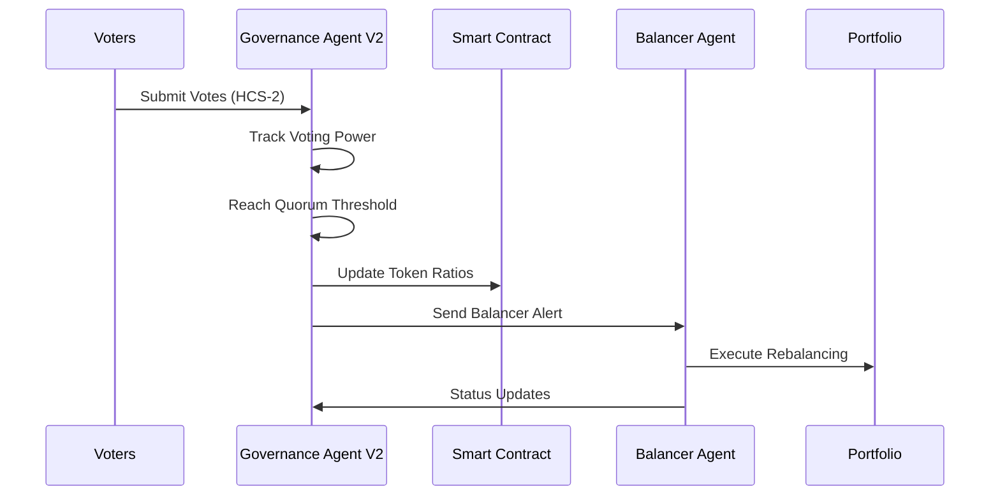

```
╔═══════════════════════════════════════════════════════════════╗
║                  🦅 LYNX GOVERNANCE AGENT V2                  ║
║            Decentralized Token Portfolio Governance           ║
╚═══════════════════════════════════════════════════════════════╝
```


## 🎯 Overview

The **Lynx Governance Agent V2** is an AI powered agent that manages decentralized governance voting for token portfolio ratios on the Hedera Hashgraph network. It orchestrates the complete governance lifecycle from vote collection to smart contract execution, working seamlessly with the [Lynx Balancer Agent](https://github.com/0xPrimordia/lynx-balancer-agent) for automated portfolio rebalancing and the [Lynx Frontend](https://github.com/0xPrimordia/lynx) for user interface and governance voting.

### ✨ Key Features

- 🗳️ **HCS-2 Compliant Voting** - Monitors indexed voting topics for governance votes
- ⚖️ **Intelligent Vote Tallying** - Processes votes when quorum threshold is reached  
- 🏛️ **Smart Contract Integration** - Updates on-chain ratios based on governance results
- 📊 **Real-time Monitoring** - Tracks voting power and provides live status updates
- 🔗 **Agent Coordination** - Communicates with balancer agent for portfolio execution
- 📸 **State Snapshots** - Creates immutable records of governance decisions
- 🚨 **Multi-Channel Alerts** - Sends notifications across dashboard and balancer topics

## 🏗️ Architecture

```
┌─────────────────┐    ┌─────────────────┐    ┌─────────────────┐
│   Voter Dapps   │ -> │ HCS-2 Voting    │ -> │ Governance      │
│                 │    │ Topic           │    │ Agent V2        │
└─────────────────┘    └─────────────────┘    └─────────────────┘
                                                        │
                                                        ▼
┌─────────────────┐    ┌─────────────────┐    ┌─────────────────┐
│ Portfolio       │ <- │ Lynx Balancer   │ <- │ Smart Contract  │
│ Rebalancing     │    │ Agent           │    │ Ratio Update    │
└─────────────────┘    └─────────────────┘    └─────────────────┘
```

## 🚀 Governance Workflow

1. **👥 Vote Collection** - Monitors HCS-2 voting topic for incoming governance votes
2. **📊 Power Tracking** - Maintains running total of voting power in memory  
3. **🎯 Quorum Detection** - Triggers tallying when threshold (1000) is reached
4. **🏆 Result Processing** - Determines winning token ratios from all votes
5. **⚙️ Contract Execution** - Updates smart contract with new portfolio ratios
6. **📸 Snapshot Creation** - Records governance state to snapshot topic
7. **🔗 Agent Communication** - Notifies balancer agent for portfolio rebalancing

## 🛠️ Setup & Installation

### Prerequisites

- **Node.js** >= 20.0.0
- **TypeScript** >= 5.7.2
- **Hedera Testnet Account** with HBAR balance
- **OpenAI API Key** for LangChain integration

### Installation

```bash
# Clone the repository
git clone https://github.com/yourusername/lynx-governance-agentv2
cd lynx-governance-agentv2

# Install dependencies
npm install

# Copy and configure environment
cp env.example .env
# Fill in your actual values in .env
```

### Environment Configuration

```bash
# 🌐 HEDERA NETWORK CONFIGURATION
HEDERA_NETWORK=testnet
HEDERA_ACCOUNT_ID=0.0.123456
HEDERA_PRIVATE_KEY=your_der_private_key_here

# 🤖 OPENAI INTEGRATION  
OPENAI_KEY=sk-your-openai-api-key-here

# 📄 SMART CONTRACT ADDRESSES
LYNX_CONTRACT=0.0.contract_id

# 🗳️ HEDERA CONSENSUS SERVICE TOPICS
CURRENT_ROUND_VOTING_TOPIC=0.0.topic_id
TOKEN_RATIO_SNAPSHOT_TOPIC=0.0.topic_id
BALANCER_ALERT_TOPIC=0.0.topic_id
DASHBOARD_ALERT_TOPIC=0.0.topic_id
```

## 📋 Usage

### Start the Governance Agent

```bash
# Build and start the agent
npm start

# Development mode with auto-reload
npm run dev
```

### Test the System

```bash
# Send a test governance vote
npm run send:vote

# Send a test dashboard alert  
npm run send:alert

# Send a test token ratio snapshot
npm run send:snapshot
```

## 🧰 Utility Scripts & Commands

### Core Commands

| Command | Description | Usage Example |
|---------|-------------|---------------|
| `npm start` | Build and start governance agent | Production deployment |
| `npm run build` | Compile TypeScript to JavaScript | CI/CD pipelines |
| `npm run dev` | Development mode with hot reload | Local development |

### Testing & Utilities

| Command | Description | Purpose |
|---------|-------------|---------|
| `npm run send:vote` | Submit test governance vote | Verify voting topic integration |
| `npm run send:alert` | Send test dashboard alert | Test alert system functionality |  
| `npm run send:snapshot` | Create test token ratio snapshot | Validate snapshot topic setup |

### Utility Files

#### 📊 `src/utils/send-test-vote.ts`
- **Purpose**: Creates and submits HCS-2 compliant test votes
- **Features**: DER key handling, topic auto-creation, vote validation
- **Schema**: Uses `MultiRatioVoteSchema` with portfolio ratio changes

#### 🚨 `src/utils/send-test-dash-alert.ts`  
- **Purpose**: Sends test alerts to dashboard notification topic
- **Features**: Alert schema validation, topic verification
- **Schema**: Uses `AlertSchema` with title, message, type, timestamp

#### 📸 `src/utils/send-test-token-ratio-snapshot.ts`
- **Purpose**: Creates test token ratio snapshots with integrity hashing
- **Features**: Non-indexed HCS-2 topics, SHA-256 hashing, governance session tracking
- **Schema**: Uses `TokenRatioSnapshotDataSchema` with complete metadata

## 🔗 Agent Integration

This governance agent works in coordination with the **[Lynx Balancer Agent](https://github.com/0xPrimordia/lynx-balancer-agent)** to provide end-to-end automated portfolio management.

### Communication Flow



### Balancer Agent Features

The companion [Balancer Agent](https://github.com/0xPrimordia/lynx-balancer-agent) provides:

- 🔄 **Automated Rebalancing** - Executes portfolio adjustments based on governance decisions
- 🤝 **HCS-10 Communication** - Secure agent-to-agent messaging protocol  
- 📈 **Progress Reporting** - Real-time status updates during rebalancing operations
- ⚡ **V3 Hedera Agent Kit** - Modern LangChain-based agent architecture
- 🛡️ **Connection Security** - Explicit approval and account-based authentication

## 🖥️ Frontend Integration

This governance agent integrates with the **[Lynx Frontend](https://github.com/0xPrimordia/lynx)** - a modern Next.js web application that provides the user interface for governance voting and portfolio management.

### Frontend Features

The [Lynx Frontend](https://github.com/0xPrimordia/lynx) offers:

- 🗳️ **Governance Voting Interface** - Interactive sliders for token ratio adjustments
- 💰 **Token Minting/Burning** - Real-time portfolio composition and token operations
- 📊 **Live Portfolio Monitoring** - Real-time balance and ratio tracking
- 🏛️ **Governance Dashboard** - Historical voting data and decision tracking
- 🔗 **Hedera Wallet Integration** - Multi-wallet support (HashPack, Blade, MyHbarWallet)
- 📱 **Responsive Design** - Modern UI with retro terminal aesthetic

### User Workflow

1. **Vote Submission** - Users submit governance votes through the frontend interface
2. **HCS-2 Processing** - Votes are sent to HCS-2 topics for agent processing
3. **Real-time Updates** - Frontend receives live updates on governance decisions
4. **Portfolio Reflection** - New ratios are immediately reflected in the minting interface

## 🏛️ Smart Contract Integration

### Supported Tokens

The governance system manages ratios for 6 hardcoded tokens:

- **HBAR** - Native Hedera token
- **WBTC** - Wrapped Bitcoin  
- **SAUCE** - Community token
- **USDC** - USD Coin stablecoin
- **JAM** - Ecosystem token
- **HEADSTART** - Launch token

### Contract Function

```solidity
function updateRatios(
    uint256 hbarRatio,
    uint256 wbtcRatio, 
    uint256 sauceRatio,
    uint256 usdcRatio,
    uint256 jamRatio,
    uint256 headstartRatio
) external onlyGovernance
```

## 🔧 Advanced Configuration

### Quorum Threshold

The default quorum threshold is set to **1000 voting power**. To modify:

```typescript
// In src/agent/lynx-governance-agent.ts
const QUORUM_THRESHOLD = 1000; // Change this value
```

### Custom Vote Schema

Extend the voting schema in `src/typescript/vote.ts`:

```typescript
export const CustomVoteSchema = z.object({
  // Add custom fields here
  customField: z.string().optional(),
}).merge(MultiRatioVoteSchema);
```

### HCS-2 Topic Configuration

Topics are configured with different indexing strategies:

- **Voting Topics**: `hcs-2:0:86400` (indexed, 1 day TTL)
- **Snapshot Topics**: `hcs-2:1:3600` (non-indexed, 1 hour TTL) 
- **Alert Topics**: Standard HCS topics for notifications

## 🔍 Monitoring & Debugging

### Agent Logs

The agent provides detailed logging for:

- 🗳️ Vote processing and validation
- 📊 Voting power tracking and quorum detection  
- 🏛️ Smart contract interaction results
- 📸 Snapshot creation and submission
- 🚨 Alert dispatching across all topics

### Health Checks

Monitor agent health through:

```bash
# Check agent status
curl http://localhost:3000/health

# Validate environment configuration  
npm run validate-config

# Test topic connectivity
npm run test-topics
```

## 🤝 Contributing

We welcome contributions! Please follow these steps:

1. **Fork** the repository
2. **Create** a feature branch (`git checkout -b feature/amazing-feature`)
3. **Commit** your changes (`git commit -m 'Add amazing feature'`)
4. **Push** to the branch (`git push origin feature/amazing-feature`)
5. **Open** a Pull Request

### Development Guidelines

- ✅ Use TypeScript with strict mode enabled
- ✅ Follow the existing code style and patterns
- ✅ Add tests for new functionality
- ✅ Update documentation for any API changes
- ✅ Ensure all utilities work with both DER and standard key formats

## 📄 License

This project is licensed under the **Apache-2.0 License** - see the [LICENSE](LICENSE) file for details.

## 🙋‍♂️ Support & Community

- 📚 **Documentation**: Check the `/docs` directory for detailed guides
- 🐛 **Issues**: Report bugs and request features via GitHub Issues  
- 💬 **Discussions**: Join the community discussions for help and ideas
- 🔗 **Balancer Agent**: See the [companion repository](https://github.com/0xPrimordia/lynx-balancer-agent)
- 🖥️ **Frontend**: Check out the [Lynx Frontend](https://github.com/0xPrimordia/lynx) for the user interface

---

<div align="center">

**🦅 Built with ❤️ using Hedera Hashgraph, HCS-2 Protocol, and LangChain AI**

[](https://hedera.com)
[](https://hashgraphonline.com/docs/standards/hcs-2/)
[](https://langchain.com)

</div>
